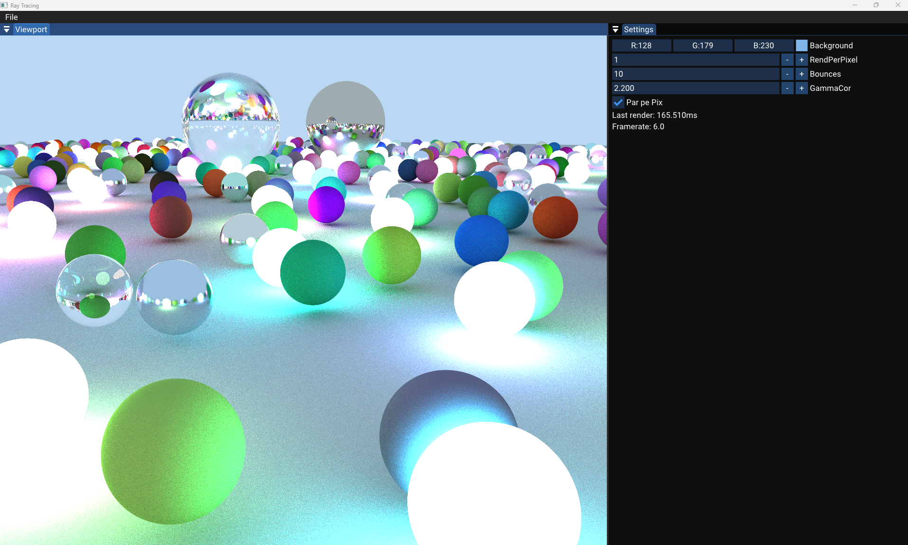

# RayTracing

A CPU based path tracing renderer engine implemented in C++  
This project aims to explore and demonstrate the fundamentals of ray tracing — generating images by tracing the path of light as rays, handling reflections, refractions, shadows, etc.


---


## Features

At present, this implementation supports:

- Basic ray–sphere intersection
- Basic ray-box intersection
- Phong shading model (ambient, diffuse, specular)
- Shadows (shadow rays)
- Reflection & recursive reflection
- Refraction / transparency (Snell’s law)
- Multiple light sources
- environment color
- Anti-aliasing (supersampling)
- Acceleration structures (BVH)

You can (or plan to) extend it with:

- Triangle intersections
- Mesh importing
- Moving the code to the GPU
---

## Dependencies & Requirements

- C++ compiler
- Vulkan SDK
- CMake

## Installation / Build Instructions

Here’s a sample of how to build and run the project:

```bash
# Clone the repository
git clone https://github.com/stefanbusoi/RayTracing.git
cd RayTracing

# (If using CMake)
mkdir build
cd build
cmake ..
make
```

## 3rd party libraries

- Walnut
- Dear ImGui
- GLFW
- stb_image
- GLM
